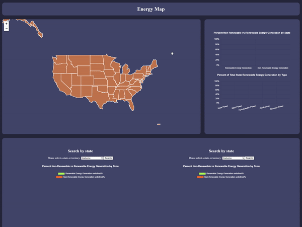

<div align="center">
  
</div>

<br/>

<div align='center'>

[](https://www.javascript.com/)
[](https://www.typescriptlang.org/)
[](https://react.dev/)
[](https://redux.js.org/)
[](https://nodejs.org/en)
[](https://expressjs.com/)
[](https://www.postgresql.org/)
[](https://www.chartjs.org/)


[](https://www.docker.com/)
[](https://jestjs.io/)
[](https://webpack.js.org/)

</div>

<h3 align="center">
Energy Map, a data visualization site, that compares the usage of renewable vs non-renewable energy sources across different states.
</h3>

## Features

- **Interactive State Map:** Explore our dynamic map by hovering between states to unveil detailed renewable energy data presented as a bar graph.
- **State-to-State Comparison Tool:** Utilize our State comparison tool to effortlessly select any two states and view their renewable energy data side by side.
- **Up-to-Date Data:** Access real-time data to stay informed about the latest trends and developments in energy consumption across states.

## Getting Started

To get project up and running, please follow the steps below.

1. Fork the Project
2. Clone the Project onto your local computer
3. Run command:
   ```js
   npm run dev
   ```
4. Server should be running on localhost:3000!

## Contributions

The open-source community is awesome because of contributors like you. Your contributions are invaluable!

If you have a suggestion, fork the repo and make a pull request. You can also open an issue to discuss your idea. And, don't forget to give the project a star! Thanks!

1. Fork the Project
2. Create your Feature Branch (`git checkout -b feature/AmazingFeature`)
3. Commit your Changes (`git commit -m 'Add some AmazingFeature'`)
4. Push to the Branch (`git push origin feature/AmazingFeature`)
5. Open a Pull Request
